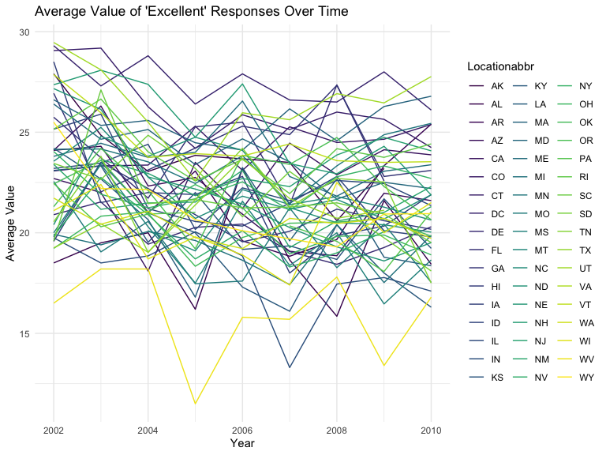
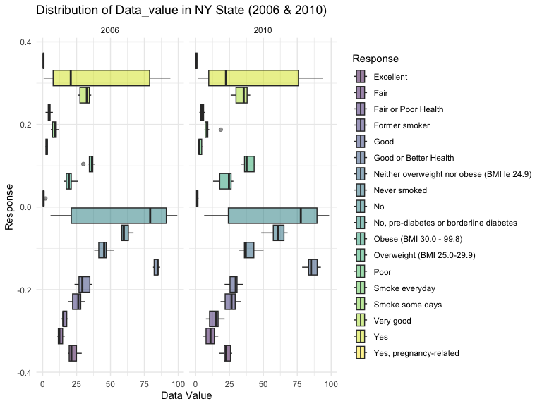
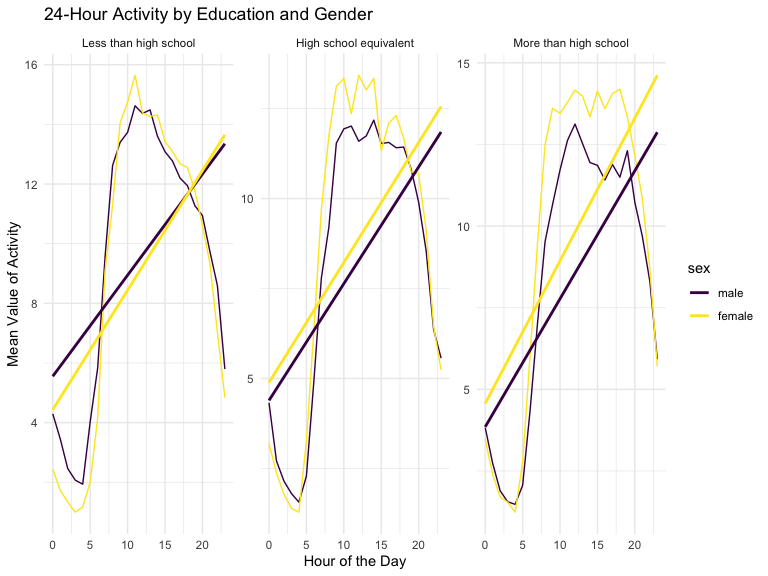

Homework 3
================
Shina Min
2023_10_14

### Problem 0

This solution focuses on a reproducible report containing code and text
necessary for Problems 1-3, and is organized as an R Project. This was
not prepared as a GitHub repo; examples for repository structure and git
commits should be familiar from other elements of the course.

Throughout, we use appropriate text to describe our code and results,
and use clear styling to ensure code is readable.

### Problem 1

#### Read in the data

``` r
data("instacart")

instacart = 
  instacart |> 
  as_tibble()
```

#### Answer questions about the data

This dataset contains 1384617 rows and 15 columns, with each row
resprenting a single product from an instacart order. Variables include
identifiers for user, order, and product; the order in which each
product was added to the cart. There are several order-level variables,
describing the day and time of the order, and number of days since prior
order. Then there are several item-specific variables, describing the
product name (e.g. Yogurt, Avocado), department (e.g. dairy and eggs,
produce), and aisle (e.g. yogurt, fresh fruits), and whether the item
has been ordered by this user in the past. In total, there are 39123
products found in 131209 orders from 131209 distinct users.

Below is a table summarizing the number of items ordered from aisle. In
total, there are 134 aisles, with fresh vegetables and fresh fruits
holding the most items ordered by far.

``` r
instacart |> 
  count(aisle) |> 
  arrange(desc(n))
```

    ## # A tibble: 134 × 2
    ##    aisle                              n
    ##    <chr>                          <int>
    ##  1 fresh vegetables              150609
    ##  2 fresh fruits                  150473
    ##  3 packaged vegetables fruits     78493
    ##  4 yogurt                         55240
    ##  5 packaged cheese                41699
    ##  6 water seltzer sparkling water  36617
    ##  7 milk                           32644
    ##  8 chips pretzels                 31269
    ##  9 soy lactosefree                26240
    ## 10 bread                          23635
    ## # ℹ 124 more rows

Next is a plot that shows the number of items ordered in each aisle.
Here, aisles are ordered by ascending number of items.

``` r
instacart |> 
  count(aisle) |> 
  filter(n > 10000) |> 
  mutate(aisle = fct_reorder(aisle, n)) |> 
  ggplot(aes(x = aisle, y = n)) + 
  geom_point() + 
  labs(title = "Number of items ordered in each aisle") +
  theme(axis.text.x = element_text(angle = 60, hjust = 1))
```


Our next table shows the three most popular items in aisles
`baking ingredients`, `dog food care`, and `packaged vegetables fruits`,
and includes the number of times each item is ordered in your table.

``` r
instacart |> 
  filter(aisle %in% c("baking ingredients", "dog food care", "packaged vegetables fruits")) |>
  group_by(aisle) |> 
  count(product_name) |> 
  mutate(rank = min_rank(desc(n))) |> 
  filter(rank < 4) |> 
  arrange(desc(n)) |>
  knitr::kable()
```

| aisle                      | product_name                                  |    n | rank |
|:---------------------------|:----------------------------------------------|-----:|-----:|
| packaged vegetables fruits | Organic Baby Spinach                          | 9784 |    1 |
| packaged vegetables fruits | Organic Raspberries                           | 5546 |    2 |
| packaged vegetables fruits | Organic Blueberries                           | 4966 |    3 |
| baking ingredients         | Light Brown Sugar                             |  499 |    1 |
| baking ingredients         | Pure Baking Soda                              |  387 |    2 |
| baking ingredients         | Cane Sugar                                    |  336 |    3 |
| dog food care              | Snack Sticks Chicken & Rice Recipe Dog Treats |   30 |    1 |
| dog food care              | Organix Chicken & Brown Rice Recipe           |   28 |    2 |
| dog food care              | Small Dog Biscuits                            |   26 |    3 |

Finally is a table showing the mean hour of the day at which Pink Lady
Apples and Coffee Ice Cream are ordered on each day of the week. This
table has been formatted in an untidy manner for human readers. Pink
Lady Apples are generally purchased slightly earlier in the day than
Coffee Ice Cream, with the exception of day 5.

``` r
instacart |>
  filter(product_name %in% c("Pink Lady Apples", "Coffee Ice Cream")) |>
  group_by(product_name, order_dow) |>
  summarize(mean_hour = mean(order_hour_of_day)) |>
  pivot_wider(
    names_from = order_dow, 
    values_from = mean_hour) |>
  knitr::kable(digits = 2)
```

    ## `summarise()` has grouped output by 'product_name'. You can override using the
    ## `.groups` argument.

| product_name     |     0 |     1 |     2 |     3 |     4 |     5 |     6 |
|:-----------------|------:|------:|------:|------:|------:|------:|------:|
| Coffee Ice Cream | 13.77 | 14.32 | 15.38 | 15.32 | 15.22 | 12.26 | 13.83 |
| Pink Lady Apples | 13.44 | 11.36 | 11.70 | 14.25 | 11.55 | 12.78 | 11.94 |

### Problem 2

his problem uses the BRFSS data. DO NOT include this dataset in your
local data directory; instead, load the data from the p8105.datasets
package using

## Loading the package for Problem 2.

``` r
library(p8105.datasets)
data("brfss_smart2010")
```

## Formatting, organizing, and data cleaning.

``` r
brffs_smart2010_df=
  brfss_smart2010 %>%
  janitor::clean_names() %>%
  filter(topic == "Overal Health" &
           response %in% c("Excellent", "Very Good", "Good", "Fair", "Poor")) %>%
  mutate(response = factor(response, levels = c("Poor", "Fair", "Good", "Very Good", "Excellent")))
```

## States observed at 7 or more locations in 2002 and 2010.

``` r
brffs_smart2010_df %>%
  filter(year %in% c(2002, 2010)) %>% 
  group_by(year, locationabbr) %>%
  summarize(n_obs = n()) %>%
  filter(n_obs >= 7) %>%
  arrange(year, desc(n_obs))
```

    ## `summarise()` has grouped output by 'year'. You can override using the
    ## `.groups` argument.

    ## # A tibble: 0 × 3
    ## # Groups:   year [0]
    ## # ℹ 3 variables: year <int>, locationabbr <chr>, n_obs <int>

## Construct a dataset that is limited to Excellent responses, and contains, year, state, and a variable that averages the data_value across locations within a state.

``` r
excellent_data =
  brfss_smart2010 %>%
  filter(Response %in% c("Excellent")) %>%
  select(Year, Locationabbr, Data_value) %>%
  group_by(Locationabbr, Year) %>%
  mutate(avg_data_value = mean(Data_value)) %>%
  select(Year, Locationabbr, avg_data_value) %>%
  distinct()
```

- In 2002, PA, MA, NJ, CT, FL, NC (total of 6 states) were observed at 7
  or more locations. In 2010, total of 14 states were observed at 7 or
  more locations, including FL, NJ, TX, CA, MD, NC, NE, WA, MA, NY, OH,
  CO, PA, SC.
- WA were observed at 7 or more locations in 2010.

## Making a “spaghetti” plot

``` r
excellent_data %>%
  ggplot(aes(x = Year, y = avg_data_value, color = Locationabbr)) +
  geom_line() +
  labs(title = "Average Value of 'Excellent' Responses Over Time", x = "Year", y = "Average Value") +
  theme_minimal()
```



- Make a two-panel plot showing, for the years 2006, and 2010,
  distribution of data_value for responses (“Poor” to “Excellent”) among
  locations in NY State.

## Making a two-panel plot

``` r
brfss_smart2010 %>%
  select(Year, Data_value, Locationabbr, Locationdesc, Response) %>%
  filter(
    Year %in% c(2006, 2010),
    Locationabbr == "NY") %>% 
  ggplot(aes(x = Data_value, fill = Response)) +
  geom_boxplot(alpha = 0.5) +
  labs(title = "Distribution of Data_value in NY State (2006 & 2010)",
       x = "Data Value", y = "Response") +
  theme_minimal() +
  facet_grid(. ~ Year)
```



## Problem 3

``` r
library(dplyr)
```

## Load, tidy, merge and organize the data sets.

Load, tidy, merge, and otherwise organize the data sets. Your final
dataset should include all originally observed variables; exclude
participants less than 21 years of age, and those with missing
demographic data; and encode data with reasonable variable classes
(i.e. not numeric, and using factors with the ordering of tables and
plots in mind).

``` r
covar_df= 
  read.csv("~/Desktop/Hw3/nhanes_covar.csv", skip = 4) %>%
  janitor::clean_names() %>%
  drop_na() %>%
  filter(age >= 21) %>% 
  mutate(education = recode(education, "1" = "Less than high school", "2"= "High school equivalent", "3" = "More than high school")) %>%
  mutate(
    sex = recode(sex, "1" = "male", "2" = "female"),
    education = recode(education, "1" = "male")
  )

accel_df =
  read.csv("~/Desktop/Hw3/nhanes_accel.csv") %>%
  janitor::clean_names()

joined_data =
  accel_df %>%
  inner_join(covar_df, by = "seqn") %>%
  relocate(seqn, sex, age, bmi, education) %>%
  filter(age >= 21) %>%
  mutate(
    sex = forcats::fct_relevel(sex, "male", "female"),
    education = forcats::fct_relevel(education, "Less than high school", "High school equivalent", "More than high school")
  )
view(joined_data)
```

## Creating a table for the number of men and women in each category.

ADD COMMENT!

``` r
education_table =
  joined_data %>%
  group_by(education, sex) %>%
  summarize(count = n())
```

    ## `summarise()` has grouped output by 'education'. You can override using the
    ## `.groups` argument.

``` r
knitr::kable(education_table, caption = "Number of Men and Women in each Education Category", format = "markdown")
```

| education              | sex    | count |
|:-----------------------|:-------|------:|
| Less than high school  | male   |    27 |
| Less than high school  | female |    28 |
| High school equivalent | male   |    35 |
| High school equivalent | female |    23 |
| More than high school  | male   |    56 |
| More than high school  | female |    59 |

Number of Men and Women in each Education Category

## Creating a visualization of the age distributions for men and women in each education category.

``` r
age_distribition_viz =
  ggplot(joined_data, aes(x = education, y = age, fill = sex)) +
  geom_boxplot() +
  labs(title = "Age Distribution by Gender and Education",
       x = "Education Level",
       y = "Age") +
  theme_minimal() +
  theme(axis.text.x = element_text(angle = 40, hjust =1))
```

Traditional analyses of accelerometer data focus on the total activity
over the day. Using your tidied dataset, aggregate across minutes to
create a total activity variable for each participant. Plot these total
activities (y-axis) against age (x-axis); your plot should compare men
to women and have separate panels for each education level. Include a
trend line or a smooth to illustrate differences. Comment on your plot.
\## Plotting for the total activities that compare men to women.

``` r
activity_total =
joined_data %>%
  rowwise() %>%
  mutate(
    total_activity = sum(c_across(min1:min1440)) %>%
      as.numeric())

total_activity_plot =
  ggplot(activity_total, aes(x = age, y = total_activity, color = sex)) +
  geom_point(alpha = 0.5) +
  facet_wrap(~ education) +
  geom_smooth() +
  labs(title = "Total Activity by Age, Genderm and Education Level",
       x = "Age",
       y = "Total Activity",
       color = "Gender") +
  theme_minimal()
```

## Making a three-panel plot for the 24-hour activity time courses.

Accelerometer data allows the inspection activity over the course of the
day. Make a three-panel plot that shows the 24-hour activity time
courses for each education level and use color to indicate sex. Describe
in words any patterns or conclusions you can make based on this graph;
including smooth trends may help identify differences.

``` r
activity_data =
  joined_data %>%
  pivot_longer(cols = starts_with("min"), names_to = "minute", values_to = "activity") %>%
  mutate(
    minute = as.numeric(gsub("min", "", minute)),
    hour = (minute - 1) %/% 60) %>%
  group_by(education, sex, hour) %>%
  summarize(mean_activity = mean(activity)) %>%
  ungroup()
```

    ## `summarise()` has grouped output by 'education', 'sex'. You can override using
    ## the `.groups` argument.

``` r
activity_data %>%
  ggplot(aes(x = hour, y = mean_activity, color = sex)) +
  geom_line() +
  geom_smooth(method = "lm", se = FALSE, size = 1) +
  facet_wrap(. ~ education, scales = "free") +
  labs(title = "24-Hour Activity by Education and Gender",
       x = "Hour of the Day",
       y = "Mean Value of Activity") +
  theme_minimal()
```

    ## `geom_smooth()` using formula = 'y ~ x'


